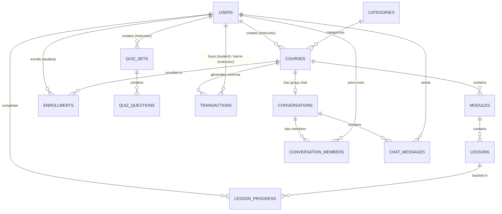

# Nexura Hub - Enterprise Backend Architecture & API Specification

> **Document Type:** Production Backend Engineering Specification & API Contract  
> **Target Engineering Team:** Backend Developers, DBAs, DevOps Engineers  
> **Backend Tech Stack:** Go (Golang 1.22+), PostgreSQL 16+ (Local or Cloud DB), WebSocket (Go-Socket.IO / Native WS), JWT Auth  
> **Architecture Pattern:** Clean Architecture / Hexagonal Architecture (Domain-Driven Design)  

---

## 🎯 Executive Overview for Backend Team

This document outlines the **simplified, high-performance backend specifications** for **Nexura Hub** LMS. The frontend is built using **React 19 + TypeScript + Redux Toolkit**. The backend service will be implemented strictly in **Golang** using **PostgreSQL** as the primary database, **In-Memory Go Primitives (Go Channels & Sync Maps)** for WebSocket room hub management, and **JWT** for authentication. **No Docker or Redis required!**

---

## 🏗️ 1. Architecture & Tech Stack Guidelines (Golang + PostgreSQL)

### 📁 Standard Go Project Structure (No Docker / No Redis)

```
nexura-backend/
├── cmd/
│   └── api/                    # Application main entry point (main.go - Run with: go run cmd/api/main.go)
├── config/                     # Environment configuration loader (Viper / .env)
├── internal/
│   ├── domain/                 # Pure Enterprise Business Models & Entities (No DB dependencies)
│   ├── usecase/                # Business Logic / Application Services
│   ├── repository/             # Database Access Layer (pgx / GORM / SQLC for PostgreSQL)
│   ├── delivery/
│   │   ├── http/               # REST API Handlers & Routers (Gin / Chi / Fiber)
│   │   └── ws/                 # In-Memory WebSocket Hub & Event Handlers (Go Channels)
│   └── middleware/             # JWT, RBAC, In-Memory Rate Limiter, CORS
├── pkg/
│   ├── auth/                   # JWT generation & password hashing (bcrypt)
│   ├── database/               # PostgreSQL Connection Pool (pgx / database/sql)
│   └── logger/                 # Structured JSON Logging (Zap / Zerolog)
├── db/
│   └── migrations/             # Versioned PostgreSQL DDL Migration SQL files (.sql)
├── .env                        # Local environment variables (DB_URL, JWT_SECRET, PORT)
└── go.mod                      # Go module dependencies
```

---

### 🎯 1.1 Entity Relationship Diagram (ERD Architecture)



### 🔗 1.2 Database Foreign Key & Relationship Cardinality Matrix

| Parent Table | Child Table | Relationship | Foreign Key Field | On Delete Policy | Rationale / Clean Code Purpose |
| :--- | :--- | :---: | :--- | :--- | :--- |
| `users` | `courses` | **1 : N** | `courses.instructor_id` | `CASCADE` | If an instructor account is deleted, their courses are removed. |
| `categories` | `courses` | **1 : N** | `courses.category_id` | `SET NULL` | Deleting a category preserves courses by setting category to NULL. |
| `courses` | `modules` | **1 : N** | `modules.course_id` | `CASCADE` | Modules cannot exist without their parent course. |
| `modules` | `lessons` | **1 : N** | `lessons.module_id` | `CASCADE` | Lessons belong strictly to a module. |
| `users` & `courses` | `enrollments` | **N : M** | `enrollments.student_id`, `course_id` | `CASCADE` | Links students to their purchased courses. |
| `users` & `lessons` | `lesson_progress` | **N : M** | `lesson_progress.student_id`, `lesson_id` | `CASCADE` | Tracks individual lesson completion status per student. |
| `quiz_sets` | `quiz_questions` | **1 : N** | `quiz_questions.quiz_set_id` | `CASCADE` | Deleting a quiz set cascades to its questions. |
| `courses` | `transactions` | **1 : N** | `transactions.course_id` | `RESTRICT` | **Financial Integrity:** Prevent deleting a course if sales transactions exist! |
| `conversations` | `chat_messages` | **1 : N** | `chat_messages.conversation_id` | `CASCADE` | Messages belong to a chat channel/room. |

---

### 🧼 1.3 Clean Code & Enterprise Go Standards

To ensure the Go codebase remains **modular, testable, and enterprise-ready**, the backend team MUST enforce the following code quality rules:

1. **Strict Dependency Injection via Interfaces:**
   - Use interfaces in the `usecase` layer to decouple business logic from database implementations.
   ```go
   type UserRepository interface {
       GetByID(ctx context.Context, id uuid.UUID) (*domain.User, error)
       Create(ctx context.Context, user *domain.User) error
   }
   ```
2. **Context Propagation (`context.Context`):**
   - Every service, repository, and database handler function MUST accept `ctx context.Context` as its first parameter to support request tracing, timeouts, and graceful cancellation.
3. **Structured Custom Error Handling:**
   - Define domain-specific sentinel errors (e.g. `domain.ErrUserNotFound`, `domain.ErrInsufficientPermissions`, `domain.ErrCourseNotPublished`) in `internal/domain/errors.go`.
   - Never expose raw SQL or database error strings to the HTTP response payload.
4. **DTO vs Domain Model Separation:**
   - Keep API JSON request/response DTO structs in delivery package separate from core DB Domain models. Use explicit mappings.
5. **Database Indexing:**
   - All foreign keys and fields used in `WHERE`, `ORDER BY`, or `JOIN` clauses MUST have B-Tree indexes created in migration files.

---

## 🗄️ 2. PostgreSQL Relational Database Schema (DDL Specs)

Below is the production-ready PostgreSQL schema with primary keys, foreign keys, indexes, constraints, and JSONB fields.

```sql
-- Enable UUID extension
CREATE EXTENSION IF NOT EXISTS "uuid-ossp";

-- 1. USERS TABLE
CREATE TYPE user_role AS ENUM ('student', 'instructor', 'admin');
CREATE TYPE user_status AS ENUM ('active', 'suspended', 'pending');

CREATE TABLE users (
    id UUID PRIMARY KEY DEFAULT uuid_generate_v4(),
    first_name VARCHAR(100) NOT NULL,
    last_name VARCHAR(100) NOT NULL,
    email VARCHAR(255) UNIQUE NOT NULL,
    password_hash VARCHAR(255) NOT NULL,
    role user_role NOT NULL DEFAULT 'student',
    status user_status NOT NULL DEFAULT 'active',
    avatar TEXT,
    bio TEXT,
    occupation VARCHAR(150),
    phone VARCHAR(50),
    website VARCHAR(255),
    created_at TIMESTAMP WITH TIME ZONE DEFAULT CURRENT_TIMESTAMP,
    updated_at TIMESTAMP WITH TIME ZONE DEFAULT CURRENT_TIMESTAMP,
    deleted_at TIMESTAMP WITH TIME ZONE -- Soft Delete Column for Security & Audit Logs
);

CREATE INDEX idx_users_email ON users(email);
CREATE INDEX idx_users_role ON users(role);
CREATE INDEX idx_users_deleted ON users(deleted_at) WHERE deleted_at IS NULL;

-- 2. CATEGORIES TABLE
CREATE TABLE categories (
    id SERIAL PRIMARY KEY,
    title VARCHAR(100) NOT NULL,
    slug VARCHAR(120) UNIQUE NOT NULL,
    thumbnail TEXT,
    created_at TIMESTAMP WITH TIME ZONE DEFAULT CURRENT_TIMESTAMP
);

-- 3. COURSES TABLE
CREATE TABLE courses (
    id UUID PRIMARY KEY DEFAULT uuid_generate_v4(),
    title VARCHAR(255) NOT NULL,
    slug VARCHAR(255) UNIQUE NOT NULL,
    subtitle TEXT,
    description TEXT,
    category_id INT REFERENCES categories(id) ON DELETE SET NULL,
    instructor_id UUID NOT NULL REFERENCES users(id) ON DELETE CASCADE,
    thumbnail TEXT NOT NULL,
    price NUMERIC(10,2) NOT NULL DEFAULT 0.00,
    discount_price NUMERIC(10,2),
    is_published BOOLEAN DEFAULT FALSE,
    learning_points JSONB DEFAULT '[]',
    created_at TIMESTAMP WITH TIME ZONE DEFAULT CURRENT_TIMESTAMP,
    updated_at TIMESTAMP WITH TIME ZONE DEFAULT CURRENT_TIMESTAMP,
    deleted_at TIMESTAMP WITH TIME ZONE -- Soft Delete Column
);

CREATE INDEX idx_courses_instructor ON courses(instructor_id);
CREATE INDEX idx_courses_published ON courses(is_published);
CREATE INDEX idx_courses_deleted ON courses(deleted_at) WHERE deleted_at IS NULL;

-- 4. MODULES TABLE
CREATE TABLE modules (
    id UUID PRIMARY KEY DEFAULT uuid_generate_v4(),
    course_id UUID NOT NULL REFERENCES courses(id) ON DELETE CASCADE,
    title VARCHAR(255) NOT NULL,
    description TEXT,
    position INT NOT NULL DEFAULT 1,
    is_published BOOLEAN DEFAULT TRUE,
    created_at TIMESTAMP WITH TIME ZONE DEFAULT CURRENT_TIMESTAMP
);

-- 5. LESSONS TABLE
CREATE TABLE lessons (
    id UUID PRIMARY KEY DEFAULT uuid_generate_v4(),
    module_id UUID NOT NULL REFERENCES modules(id) ON DELETE CASCADE,
    title VARCHAR(255) NOT NULL,
    description TEXT,
    video_url TEXT,
    duration VARCHAR(50),
    is_free BOOLEAN DEFAULT FALSE,
    is_published BOOLEAN DEFAULT TRUE,
    position INT NOT NULL DEFAULT 1,
    resources JSONB DEFAULT '[]', -- Array of [{id, title, url, type, size}]
    created_at TIMESTAMP WITH TIME ZONE DEFAULT CURRENT_TIMESTAMP
);

-- 6. QUIZ SETS & QUESTIONS TABLE
CREATE TABLE quiz_sets (
    id UUID PRIMARY KEY DEFAULT uuid_generate_v4(),
    instructor_id UUID NOT NULL REFERENCES users(id) ON DELETE CASCADE,
    title VARCHAR(255) NOT NULL,
    description TEXT,
    total_marks INT DEFAULT 100,
    is_published BOOLEAN DEFAULT TRUE,
    created_at TIMESTAMP WITH TIME ZONE DEFAULT CURRENT_TIMESTAMP
);

CREATE TABLE quiz_questions (
    id UUID PRIMARY KEY DEFAULT uuid_generate_v4(),
    quiz_set_id UUID NOT NULL REFERENCES quiz_sets(id) ON DELETE CASCADE,
    title TEXT NOT NULL,
    description TEXT,
    options JSONB NOT NULL, -- Array of [{id, label, isCorrect}]
    points INT DEFAULT 10,
    created_at TIMESTAMP WITH TIME ZONE DEFAULT CURRENT_TIMESTAMP
);

-- 7. ENROLLMENTS TABLE
CREATE TABLE enrollments (
    id UUID PRIMARY KEY DEFAULT uuid_generate_v4(),
    student_id UUID NOT NULL REFERENCES users(id) ON DELETE CASCADE,
    course_id UUID NOT NULL REFERENCES courses(id) ON DELETE CASCADE,
    enrolled_at TIMESTAMP WITH TIME ZONE DEFAULT CURRENT_TIMESTAMP,
    completed_at TIMESTAMP WITH TIME ZONE,
    progress_percentage NUMERIC(5,2) DEFAULT 0.00,
    UNIQUE(student_id, course_id)
);

-- 8. LESSON PROGRESS TABLE
CREATE TABLE lesson_progress (
    id UUID PRIMARY KEY DEFAULT uuid_generate_v4(),
    student_id UUID NOT NULL REFERENCES users(id) ON DELETE CASCADE,
    lesson_id UUID NOT NULL REFERENCES lessons(id) ON DELETE CASCADE,
    completed BOOLEAN DEFAULT TRUE,
    completed_at TIMESTAMP WITH TIME ZONE DEFAULT CURRENT_TIMESTAMP,
    UNIQUE(student_id, lesson_id)
);

-- 9. PLATFORM TRANSACTIONS & 5% COMMISSION TABLE
CREATE TYPE creator_type_enum AS ENUM ('instructor', 'admin');
CREATE TYPE transaction_status AS ENUM ('completed', 'pending', 'refunded');

CREATE TABLE transactions (
    id UUID PRIMARY KEY DEFAULT uuid_generate_v4(),
    course_id UUID NOT NULL REFERENCES courses(id) ON DELETE RESTRICT,
    student_id UUID NOT NULL REFERENCES users(id) ON DELETE CASCADE,
    instructor_id UUID NOT NULL REFERENCES users(id) ON DELETE CASCADE,
    creator_type creator_type_enum NOT NULL,
    gross_amount NUMERIC(10,2) NOT NULL,
    admin_commission_rate NUMERIC(4,2) NOT NULL, -- 0.05 (5%) for instructor course, 1.0 (100%) for admin course
    admin_commission_amount NUMERIC(10,2) NOT NULL,
    instructor_earnings NUMERIC(10,2) NOT NULL,
    status transaction_status DEFAULT 'completed',
    payment_method VARCHAR(50) NOT NULL, -- bkash, nagad, card
    created_at TIMESTAMP WITH TIME ZONE DEFAULT CURRENT_TIMESTAMP
);

-- 10. CHAT CONVERSATIONS & MESSAGES TABLE
CREATE TYPE chat_type AS ENUM ('direct', 'group');

CREATE TABLE conversations (
    id UUID PRIMARY KEY DEFAULT uuid_generate_v4(),
    type chat_type NOT NULL,
    name VARCHAR(255) NOT NULL,
    avatar TEXT,
    course_id UUID REFERENCES courses(id) ON DELETE SET NULL,
    instructor_id UUID REFERENCES users(id) ON DELETE SET NULL,
    created_at TIMESTAMP WITH TIME ZONE DEFAULT CURRENT_TIMESTAMP,
    updated_at TIMESTAMP WITH TIME ZONE DEFAULT CURRENT_TIMESTAMP
);

CREATE TABLE conversation_members (
    conversation_id UUID NOT NULL REFERENCES conversations(id) ON DELETE CASCADE,
    user_id UUID NOT NULL REFERENCES users(id) ON DELETE CASCADE,
    joined_at TIMESTAMP WITH TIME ZONE DEFAULT CURRENT_TIMESTAMP,
    PRIMARY KEY(conversation_id, user_id)
);

CREATE TABLE chat_messages (
    id UUID PRIMARY KEY DEFAULT uuid_generate_v4(),
    conversation_id UUID NOT NULL REFERENCES conversations(id) ON DELETE CASCADE,
    sender_id UUID NOT NULL REFERENCES users(id) ON DELETE CASCADE,
    content TEXT,
    image_url TEXT,
    reply_to_id UUID REFERENCES chat_messages(id) ON DELETE SET NULL,
    reactions JSONB DEFAULT '[]', -- [{emoji: "👍", count: 2, users: ["uuid1", "uuid2"]}]
    created_at TIMESTAMP WITH TIME ZONE DEFAULT CURRENT_TIMESTAMP
);

CREATE INDEX idx_chat_messages_conv ON chat_messages(conversation_id, created_at DESC);
```

---

## 💰 3. Business Logic: Platform 5% Commission Cut in Go Transaction

When a student enrolls in a course, the Go backend must execute this DB Transaction:

```go
// Calculate Commission Logic:
// If creator is Instructor: Admin Commission = 5% (0.05), Instructor Earnings = 95% (0.95)
// If creator is Admin: Admin Commission = 100% (1.00), Instructor Earnings = 0% (0.00)

func EnrollCourseTx(ctx context.Context, db *sql.DB, studentID, courseID uuid.UUID, paymentMethod string) error {
    tx, err := db.BeginTx(ctx, nil)
    if err != nil {
        return err
    }
    defer tx.Rollback()

    // 1. Fetch Course details & instructor
    var coursePrice float64
    var instructorID uuid.UUID
    var instructorRole string
    err = tx.QueryRowContext(ctx, `
        SELECT c.price, c.instructor_id, u.role 
        FROM courses c JOIN users u ON c.instructor_id = u.id 
        WHERE c.id = $1 AND c.is_published = true`, courseID).Scan(&coursePrice, &instructorID, &instructorRole)
    if err != nil {
        return fmt.Errorf("course not found or not published")
    }

    var commissionRate float64 = 0.05
    var creatorType string = "instructor"
    if instructorRole == "admin" {
        commissionRate = 1.00
        creatorType = "admin"
    }

    adminAmount := coursePrice * commissionRate
    instructorAmount := coursePrice - adminAmount

    // 2. Insert Transaction Record
    _, err = tx.ExecContext(ctx, `
        INSERT INTO transactions (course_id, student_id, instructor_id, creator_type, gross_amount, admin_commission_rate, admin_commission_amount, instructor_earnings, payment_method)
        VALUES ($1, $2, $3, $4, $5, $6, $7, $8, $9)`,
        courseID, studentID, instructorID, creatorType, coursePrice, commissionRate, adminAmount, instructorAmount, paymentMethod)
    if err != nil {
        return err
    }

    // 3. Insert Enrollment
    _, err = tx.ExecContext(ctx, `INSERT INTO enrollments (student_id, course_id) VALUES ($1, $2)`, studentID, courseID)
    if err != nil {
        return err
    }

    // 4. Auto-Add Student to Course Group Chat Room
    var groupConvID uuid.UUID
    err = tx.QueryRowContext(ctx, `SELECT id FROM conversations WHERE course_id = $1 LIMIT 1`, courseID).Scan(&groupConvID)
    if err == nil {
        _, _ = tx.ExecContext(ctx, `INSERT INTO conversation_members (conversation_id, user_id) VALUES ($1, $2) ON CONFLICT DO NOTHING`, groupConvID, studentID)
    }

    return tx.Commit()
}
```

---

## 👥 4. Role & Authorization Matrix (RBAC)

- **Student (`student`):** Access to public courses, purchasing courses, watching player lessons, submitting quizzes, receiving certificates, using chat.
- **Instructor (`instructor`):** Access to `/dashboard`, creating courses, modules, lessons, quiz sets, scheduling live streams, viewing earnings (95% cut), chatting with students.
- **Admin (`admin`):** Access to `/admin`, course moderation (Approve/Reject), user management (Activate/Suspend/Role Change), platform GMV and 5% net commission logs. **No Chat Access (Blocked by middleware).**

---

## 📡 5. Complete REST API Endpoint Contracts

### 🔑 Authentication Endpoints

#### `POST /api/v1/auth/register`
- **Request Body:**
```json
{
  "firstName": "John",
  "lastName": "Doe",
  "email": "john@example.com",
  "password": "SecurePassword123!",
  "role": "student" // "student" | "instructor"
}
```
- **Response `201 Created`:**
```json
{
  "status": "success",
  "data": {
    "token": "eyJhbGciOiJIUzI1NiIsInR5cCI6IkpXVCJ9...",
    "user": {
      "id": "c7a8b9f1-3d2e-4b5a-9f8e-1a2b3c4d5e6f",
      "firstName": "John",
      "lastName": "Doe",
      "email": "john@example.com",
      "role": "student",
      "avatar": "https://avatars.githubusercontent.com/u/1001",
      "status": "active"
    }
  }
}
```

#### `POST /api/v1/auth/login`
- **Request Body:**
```json
{
  "email": "admin@nexurahub.com",
  "password": "Password123!"
}
```
- **Response `200 OK`:**
```json
{
  "status": "success",
  "data": {
    "token": "eyJhbGciOiJIUzI1...",
    "user": {
      "id": "a1b2c3d4-e5f6-7a8b-9c0d-1e2f3a4b5c6d",
      "firstName": "Rakibul",
      "lastName": "Hasan",
      "email": "admin@nexurahub.com",
      "role": "admin"
    }
  }
}
```

---

### 📚 Course Public & Student Endpoints

#### `GET /api/v1/courses`
- **Query Parameters:** `page=1&limit=10&search=react&category=web-dev`
- **Response `200 OK`:**
```json
{
  "status": "success",
  "meta": { "total": 24, "page": 1, "totalPages": 3 },
  "data": [
    {
      "id": "e8d7c6b5-a432-10fe-dcba-9876543210fe",
      "slug": "reactive-accelerator",
      "title": "Reactive Accelerator",
      "subtitle": "Master React 19 & Redux Toolkit",
      "category": "Web Development",
      "thumbnail": "https://images.unsplash.com/photo-1633356122544-f134324a6cee",
      "price": 4500.00,
      "discountPrice": 3500.00,
      "isPublished": true,
      "instructor": {
        "id": "inst-101",
        "name": "Tapas Adhikary",
        "avatar": "https://avatars.githubusercontent.com/u/3633137"
      }
    }
  ]
}
```

#### `POST /api/v1/courses/:courseId/enroll`
- **Headers:** `Authorization: Bearer <JWT>`
- **Request Body:**
```json
{
  "paymentMethod": "bkash" // "bkash" | "nagad" | "card"
}
```
- **Response `200 OK`:**
```json
{
  "status": "success",
  "message": "Enrolled successfully",
  "data": {
    "enrollmentId": "enr-998877",
    "courseId": "e8d7c6b5-a432-10fe-dcba-9876543210fe",
    "groupConversationId": "group-1"
  }
}
```

---

### 👨‍🏫 Instructor Studio Endpoints (`/dashboard`)

#### `GET /api/v1/instructor/dashboard/stats`
- **Headers:** `Authorization: Bearer <Instructor-JWT>`
- **Response `200 OK`:**
```json
{
  "status": "success",
  "data": {
    "totalEarnings": 142500.00, // 95% net earnings
    "activeStudents": 350,
    "totalCourses": 4,
    "recentEnrollments": [
      {
        "studentName": "Rahim Ahmed",
        "courseTitle": "Reactive Accelerator",
        "price": 3500.00,
        "instructorNet": 3325.00, // 95%
        "date": "2026-09-14T10:00:00Z"
      }
    ]
  }
}
```

#### `POST /api/v1/instructor/courses`
- **Request Body:**
```json
{
  "title": "Fullstack Go & React Enterprise Masterclass",
  "category": "Software Engineering",
  "price": 5000.00,
  "discountPrice": 4200.00,
  "description": "Learn clean architecture in Go with React frontend."
}
```

---

### 🛡️ Admin Control Hub Endpoints (`/admin`)

#### `GET /api/v1/admin/overview`
- **Headers:** `Authorization: Bearer <Admin-JWT>`
- **Response `200 OK`:**
```json
{
  "status": "success",
  "data": {
    "totalRevenue": 580000.00,       // GMV Total Sales
    "adminNetCommission": 58000.00,  // 5% of instructor sales + 100% self courses
    "instructorPayouts": 522000.00,  // 95% instructor payouts
    "totalStudents": 1200,
    "totalInstructors": 45,
    "totalCourses": 80
  }
}
```

#### `PATCH /api/v1/admin/courses/:id/approve`
- **Headers:** `Authorization: Bearer <Admin-JWT>`
- **Response `200 OK`:**
```json
{
  "status": "success",
  "message": "Course approved and published successfully",
  "data": { "courseId": "c101", "isPublished": true }
}
```

#### `PATCH /api/v1/admin/users/:id/status`
- **Request Body:**
```json
{
  "status": "suspended" // "active" | "suspended" | "pending"
}
```

---

## ⚡ 6. WebSocket Protocol Specifications (`ws://backend/ws`)

### 📌 Connection Authentication:
Clients connect with JWT Auth token in connection header or query parameter:
`ws://localhost:8080/ws?token=<JWT_TOKEN>`

### 📨 Client Emitters & Server Handlers:

1. **Join Conversation Room (`join_room`):**
```json
// Client -> Server
{
  "event": "join_room",
  "data": { "conversationId": "group-1" }
}
```

2. **Send Message (`send_message`):**
```json
// Client -> Server
{
  "event": "send_message",
  "data": {
    "conversationId": "group-1",
    "message": {
      "content": "Hello everyone! Happy learning.",
      "imageUrl": null
    }
  }
}

// Server -> Room Broadcast (receive_message)
{
  "event": "receive_message",
  "data": {
    "conversationId": "group-1",
    "message": {
      "id": "msg-992211",
      "senderId": "user-1",
      "senderName": "Rahim Ahmed",
      "senderAvatar": "https://avatars.githubusercontent.com/u/1",
      "senderRole": "student",
      "content": "Hello everyone! Happy learning.",
      "timestamp": "10:45 AM",
      "reactions": []
    }
  }
}
```

3. **Message Emoji Reaction (`send_reaction`):**
```json
// Client -> Server
{
  "event": "send_reaction",
  "data": {
    "conversationId": "group-1",
    "messageId": "msg-992211",
    "emoji": "❤️",
    "userId": "user-1"
  }
}

// Server -> Room Broadcast (receive_reaction)
{
  "event": "receive_reaction",
  "data": {
    "conversationId": "group-1",
    "messageId": "msg-992211",
    "emoji": "❤️",
    "userId": "user-1"
  }
}
```

4. **Typing Status (`typing_status`):**
```json
// Client -> Server
{
  "event": "typing_status",
  "data": {
    "conversationId": "group-1",
    "userId": "user-1",
    "userName": "Rahim Ahmed",
    "isTyping": true
  }
}
```

---

## 💡 7. Production Scaling Pro-Tips & Architectural Decisions

### 7.1 Soft Deletes (`deleted_at TIMESTAMP WITH TIME ZONE`)
- **Security & Financial Auditability:** In enterprise LMS platforms, entities like `users`, `courses`, and `transactions` must NEVER be hard-deleted (`DELETE FROM`). Hard deletion breaks financial audit trails and historical reporting.
- **Implementation:**
  - All query endpoints (`SELECT`) MUST filter out soft-deleted records using `WHERE deleted_at IS NULL`.
  - Use PostgreSQL Partial Indexes for ultra-fast queries:
    ```sql
    CREATE INDEX idx_users_deleted ON users(deleted_at) WHERE deleted_at IS NULL;
    CREATE INDEX idx_courses_deleted ON courses(deleted_at) WHERE deleted_at IS NULL;
    ```

---

### 7.2 WebSocket Protocol Alignment (Socket.IO Client vs Go Server)
- **Protocol Conflict Warning:** The frontend uses `socket.io-client`. Socket.IO adds a custom framing protocol (Engine.IO) over raw WebSocket connections. If the Go backend uses raw `gorilla/websocket`, connection handshakes will fail!
- **Recommended Backend Solutions:**
  - **Option A (Recommended for Go):** Use `github.com/zishang520/socket.io-go` or `github.com/googollee/go-socket.io` in the Go backend. This supports Socket.IO rooms, events, and automatic reconnection natively.
  - **Option B:** If using `gorilla/websocket`, update the frontend to use standard native browser WebSockets (`new WebSocket("ws://...")`) or raw WebSocket transport (`transports: ["websocket"]`).

---

### 7.3 High-Performance Cursor-Based Pagination
- **Problem with `OFFSET`:** `SELECT * FROM chat_messages OFFSET 10000 LIMIT 20` forces PostgreSQL to scan 10,000 index rows, causing significant latency at scale ($O(N)$).
- **Cursor Solution ($O(1)$ Index Lookup):**
  - Implement Cursor-based pagination for Chat Messages and Course Feeds:
    ```sql
    -- Fetch next 20 messages older than cursor message ID
    SELECT * FROM chat_messages 
    WHERE conversation_id = $1 AND created_at < (SELECT created_at FROM chat_messages WHERE id = $2)
    ORDER BY created_at DESC 
    LIMIT 20;
    ```

---

## 🔒 Security & Enterprise Best Practices

1. **Authentication:** JWT Access tokens (15m expiry) + HttpOnly Secure Refresh Tokens (7d expiry).
2. **Password Security:** Use `bcrypt` with cost factor 12 or `Argon2id`.
3. **CORS:** Allow configured origins (`http://localhost:5173`).
4. **Rate Limiting:** Implement Go In-Memory Rate Limiter (`golang.org/x/time/rate` - 100 req/min for public API, 20 req/min for auth).
5. **Database Transaction Isolation:** Use `READ COMMITTED` isolation level for transaction cut calculations.

---
*Created for Nexura Hub Backend Development Team.*
